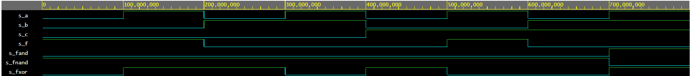

napis 1

https://www.edaplayground.com/x/s5fD

#### De morgans laws simulation
```vhdl
 f_o  <= ((not b_i) and a_i) or ((not c_i) and (not b_i));
    fnand_o <= not(a_i and b_i and c_i);
    fxor_o <= ((not a_i) and (not b_i) and c_i) or 
    		  ((not a_i) and b_i and (not c_i)) or
              (a_i and (not b_i) and (not c_i)) or
              (a_i and b_i and c_i);
    fand_o <= (a_i and b_i and c_i);

```



##### pravdivostní nabulka pro f_o

| **c** | **b** |**a** | **f(c,b,a)** |
| :-: | :-: | :-: | :-: |
| 0 | 0 | 0 | 1 |
| 0 | 0 | 1 | 1 |
| 0 | 1 | 0 | 0 |
| 0 | 1 | 1 | 0 |
| 1 | 0 | 0 | 0 |
| 1 | 0 | 1 | 1 |
| 1 | 1 | 0 | 0 |
| 1 | 1 | 1 | 0 |


