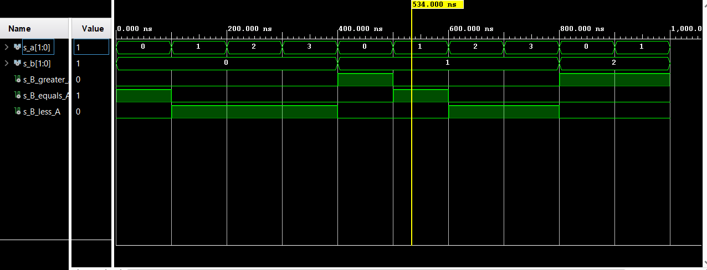
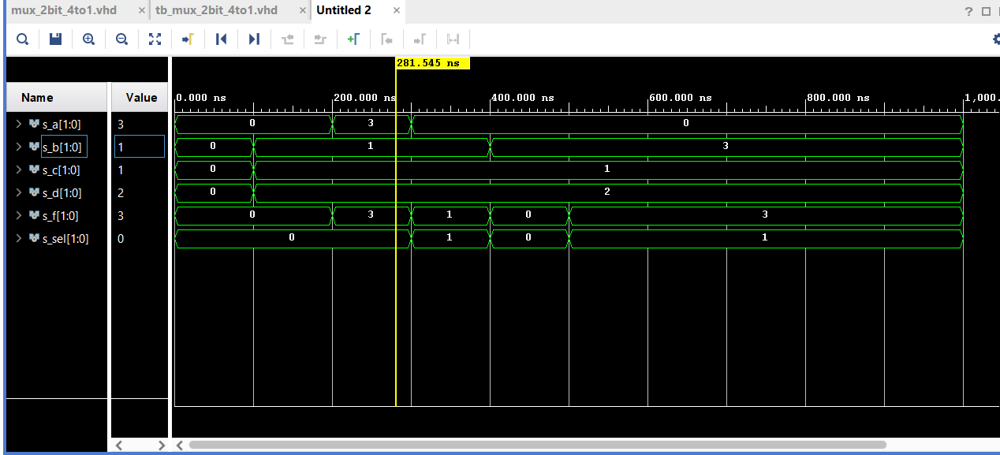

# cvičení 3
### 1)


### 2)
#### mux_2bit_4to1 kod:

```vhdl
------------------------------------------------------------------------
-- Architecture body for 2-bit binary comparator
------------------------------------------------------------------------
architecture Behavioral of comparator_2bit is
begin
    
    f_o <= a_i when (sel_i = "00") else  -- If addr_i = "000" then y_o = a_i
           b_i when (sel_i = "01") else
           c_i when (sel_i = "10") else
           d_i; -- All other combinations


    -- WRITE "GREATER" AND "EQUALS" ASSIGNMENTS HERE


end architecture Behavioral;
```
#### td_mux_2bit_4to1 kod:

```vhdl

    p_stimulus : process
    begin
        -- Report a note at the begining of stimulus process
        report "Stimulus process started" severity note;


        -- First test values
        s_d <= "00"; s_c <= "00"; s_b <= "00"; s_a <= "00";
        s_sel <= "00"; wait for 100 ns;
        
        s_d <= "10"; s_c <= "01"; s_b <= "01"; s_a <= "00";
        s_sel <= "00"; wait for 100 ns;
        
        s_d <= "10"; s_c <= "01"; s_b <= "01"; s_a <= "11";
        s_sel <= "00"; wait for 100 ns;
        
        s_d <= "10"; s_c <= "01"; s_b <= "01"; s_a <= "00";
        s_sel <= "01"; wait for 100 ns;
        
        s_d <= "10"; s_c <= "01"; s_b <= "11"; s_a <= "00";
        s_sel <= "00"; wait for 100 ns;
        
        s_d <= "10"; s_c <= "01"; s_b <= "11"; s_a <= "00";
        s_sel <= "01"; wait for 100 ns;
        
        -- Expected output
     
        -- WRITE OTHER TESTS HERE

        -- Report a note at the end of stimulus process
        report "Stimulus process finished" severity note;
        wait;
    end process p_stimulus;

end architecture testbench;
```


#### simulace 2-bit comparator:

#### simulace 2-bit mux 4to1:


### Tutorial
#### project creation:
"File -> Project -> New -> next -> enter name and location -> next -> RTL project -> add sources, next -> add contrains, next -> select board, next -> finish -> OK -> yes"
#### adding source file:
"when creating new project: add sources -> create file -> file type = vhdl -> enter name"
"add sources -> select constraints, design sources or simulation sources -> create file -> vhdl -> enter name -> finish"
#### adding testbench file:
"add sources -> select simulation sources -> create file -> enter name -> finish"
#### running simulation:
"Flow -> Run simulation -> run behavioral simulation "
#### adding XDC constraints file:
"add sources -> select add constraints -> create file -> file type: XDC -> enter name -> ok, finish"
