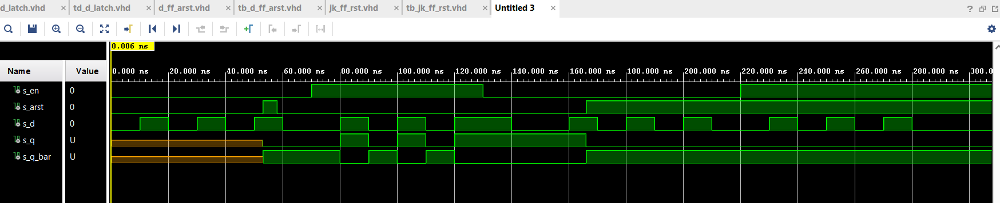
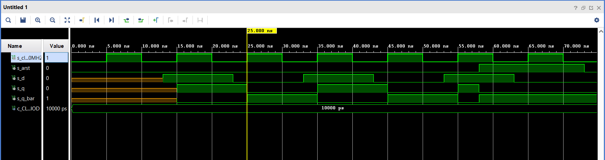
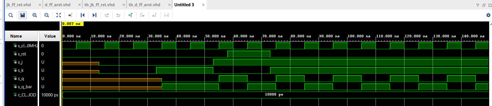
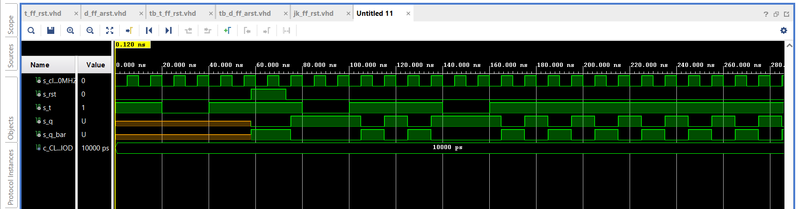
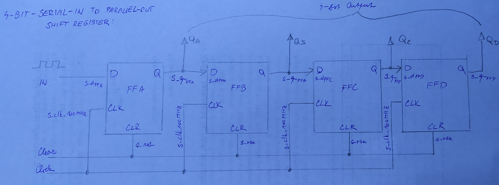

# cvičení 7
### 1)

| **D** | **Qn** | **Q(n+1)** | **Comments** |
   | :-: | :-: | :-: | :-- |
   | 0 | 0 | 0 |  |
   | 0 | 1 | 0 |  |
   | 1 | 0 | 1 |  |
   | 1 | 1 | 1 |  |

   | **J** | **K** | **Qn** | **Q(n+1)** | **Comments** |
   | :-: | :-: | :-: | :-: | :-- |
   | 0 | 0 | 0 | 0 | No change |
   | 0 | 0 | 1 | 1 | No change |
   | 0 | 1 | 0 | 0 |  |
   | 0 | 1 | 1 | 0 |  |
   | 1 | 0 | 0 | 1 |  |
   | 1 | 0 | 1 | 1 |  |
   | 1 | 1 | 0 | 1 |  |
   | 1 | 1 | 1 | 0 |  |

   | **T** | **Qn** | **Q(n+1)** | **Comments** |
   | :-: | :-: | :-: | :-- |
   | 0 | 0 | 0 |  |
   | 0 | 1 | 1 |  |
   | 1 | 0 | 1 |  |
   | 1 | 1 | 0 |  |
   
### 2)
#### VHDL code listing of the process p_d_latch with syntax highlighting:
```vhdl
p_d_latch : process (d, arst,en)
begin
    if (arst = '1') then
        q <= '0';
        q_bar <= '1';
        elsif (en = '1') then
        q<=d;
        q_bar <= not d;
    end if;
end process p_d_latch;
```
#### Listing of VHDL reset and stimulus processes from the testbench tb_d_latch.vhd file with syntax highlighting and asserts:
```vhdl
p_reset_gen : process
begin
    s_arst <= '0';
    wait for 53 ns;
    
    --reset activated
    s_arst <= '1';
    wait for 5 ns;
    
    --reset deactivated
    s_arst <= '0';
    wait for 108 ns;
    s_arst <= '1';
    wait;
end process p_reset_gen;

p_stimulus : process
begin
    report "Stimulus process started" severity note;
    s_en <= '0';
    s_d <= '0';
    
    --d sequence
    wait for 10 ns;
    s_d <= '1';
    wait for 10 ns;
    s_d <= '0';
    wait for 10 ns;
    s_d <= '1';
    wait for 10 ns;
    s_d <= '0';
    wait for 10 ns;
    s_d <= '1';
    wait for 10 ns;
    s_d <= '0';
    wait for 10 ns;
    --/d sequence
    s_en <= '1';
    
    wait for 3 ns;
    assert(s_q = '0' and s_q_bar = '1');
    
    --d sequence
    wait for 7 ns;
    s_d <= '1';
    wait for 10 ns;
    s_d <= '0';
    wait for 10 ns;
    s_d <= '1';
    wait for 10 ns;
    s_d <= '0';
    wait for 10 ns;
    s_d <= '1';
    wait for 10 ns;
    s_en <= '0';
    wait for 10 ns;
    s_d <= '0';
    wait for 10 ns;
    --/d sequence
    
    wait for 3 ns;
    assert(s_q = '1' and s_q_bar = '0');
    
    --d sequence
    wait for 7 ns;
    s_d <= '1';
    wait for 10 ns;
    s_d <= '0';
    wait for 10 ns;
    s_d <= '1';
    wait for 10 ns;
    s_d <= '0';
    wait for 10 ns;
    s_d <= '1';
    wait for 10 ns;
    s_d <= '0';
    wait for 10 ns;
    --/d sequence
    s_en <='1';
    
    wait for 3 ns;
    assert(s_q = '0' and s_q_bar = '1');
    
    --d sequence
    wait for 7 ns;
    s_d <= '1';
    wait for 10 ns;
    s_d <= '0';
    wait for 10 ns;
    s_d <= '1';
    wait for 10 ns;
    s_d <= '0';
    wait for 10 ns;
    s_d <= '1';
    wait for 10 ns;
    s_d <= '0';
    wait for 10 ns;
    --/d sequence
    report "Stimulus process finished" severity note;
    wait;
end process p_stimulus;
```
#### Screenshot with simulated time waveforms d_latch:


### 3)
#### VHDL code listing of the processes p_d_ff_arst, p_d_ff_rst, p_jk_ff_rst, p_t_ff_rst with syntax highlighting:
```vhdl
--D:
p_d_ff_arst : process (clk,arst)
begin                 
    if (arst = '1') then
        q <= '0';     
        q_bar <= '1'; 
        elsif rising_edge(clk) then
        q<=d;         
        q_bar <= not d;
    end if;           
end process p_d_ff_arst;
--JK:
 p_jk_ff_rst : process (clk)
   begin
       if rising_edge(clk) then
           if (rst ='1') then
               s_q <='0';
           else
               if(j='0' and k = '0') then
                   s_q <= s_q;
               elsif (j='0' and k = '1') then
                   s_q <= '0';
               elsif (j='1' and k = '0') then
                   s_q <= '1';
               elsif (j='1' and k = '1') then
                   s_q <= not s_q;
               end if;
            end if;
        end if;
   end process p_jk_ff_rst;
   
   architecture Behavioral of t_ff_rst is
    signal x: std_logic;
begin
--T:
p_t_ff_rst : process (clk,rst)
   begin
       if rst='1' then
            x<='0';
       elsif rising_edge(clk) then
            if t='0' then
                x<=x;
            elsif t='1' then
                x<=not(x);
            end if;
       end if;
                       
end process p_t_ff_rst;
q<=x;
q_bar<=not(x);
end Behavioral;


```
#### Listing of VHDL clock, reset and stimulus processes from the testbench files with syntax highlighting and asserts:
```vhdl
p_clk_gen : process
begin
    while now < 750 ns loop
        s_clk_100MHZ <= '0';
        wait for c_CLK_100MHZ_PERIOD /2;
        s_clk_100MHZ <= '1';
        wait for c_CLK_100MHZ_PERIOD /2;
    end loop;
    wait;
end process p_clk_gen;

p_reset_gen : process
begin
    s_rst <= '0';
    WAIT FOR 58 ns;
    --reset activated
    s_rst <= '1';
    wait for 15 ns;
    --reset deactivated
    s_rst <= '0';
    wait;
end process p_reset_gen;

p_stimulus : process
begin
    report "Stimulus process started" severity note;
    
    wait for 13 ns;
    s_j <= '0';
    s_k <= '0';
    wait for 20 ns;
    s_j <= '0';
    s_k <= '1';
    wait for 20 ns;
    s_j <= '1';
    s_k <= '0';
    wait for 20 ns;
    s_j <= '1';
    s_k <= '1';
    
    wait for 10 ns;
    
    
    report "Stimulus process finished" severity note;
    wait;
end process p_stimulus;
```
#### Screenshot with simulated time waveforms:
##### d_ff_arst:

##### d_ff_rst:

##### jk_ff_rst:

##### t_ff_rst:


### 4)

